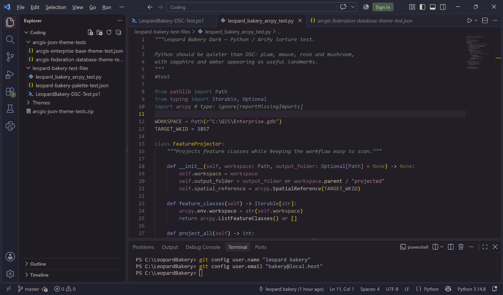
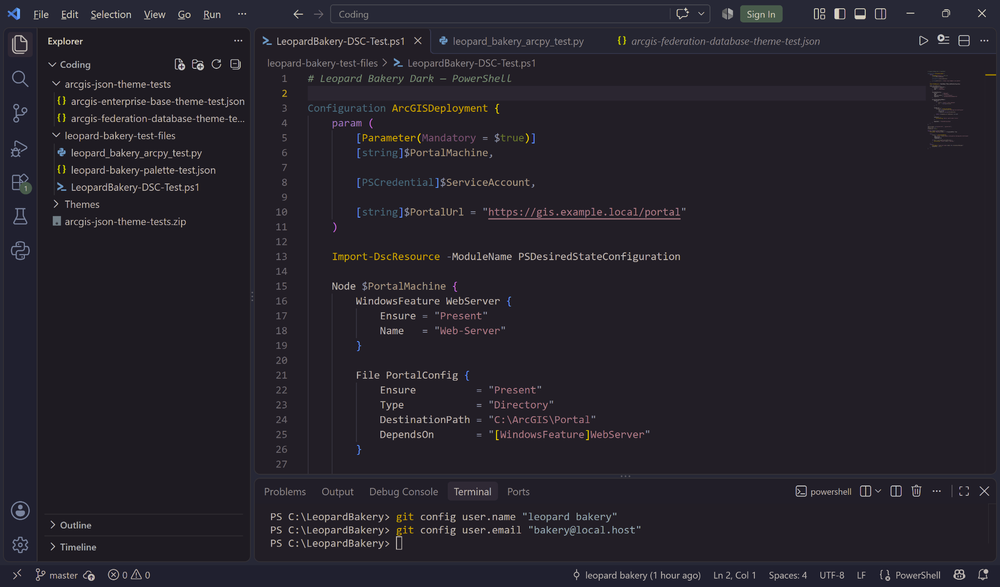
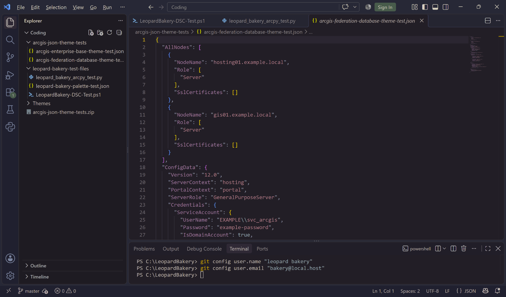

# Leopard After Dark

A low-glare dark theme built around **midnight plum, alpine forest, sapphire, warm neutrals, and restrained amber highlights.**

**Rich color without turning every line of code into a neon sign.**

Color families encode meaning; saturation encodes importance. Designed with sensory comfort and long coding sessions in mind by a neurodivergent developer, with particular attention to Python, PowerShell, JSON, GIS, and geospatial workflows. Visual preferences are personal; this is simply a calmer alternative for developers who prefer selective contrast.

**Best enjoyed in a bakery with donuts and fluffy animals.** 🐆🍩

## Python / ArcPy

## PowerShell / DSC

## JSON / Geospatial

## Installation

Search for **Leopard After Dark** in the Visual Studio Code Extensions view and select **Install**.
